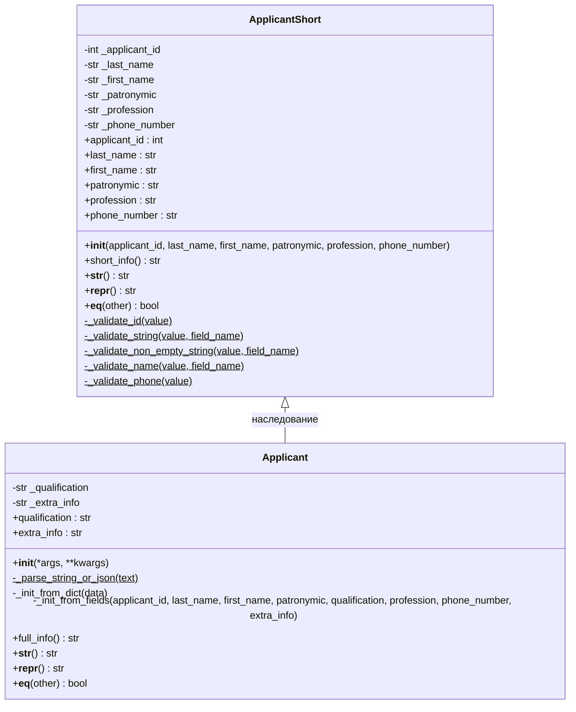

# Пункт 10. Полная диаграмма классов

## Диаграмма

## Таблица классов

### ApplicantShort (базовый класс)

| Тип | Название | Назначение |
|---|---|---|
| Поле (private) | `_applicant_id` | Уникальный идентификатор соискателя |
| Поле (private) | `_last_name` | Фамилия |
| Поле (private) | `_first_name` | Имя |
| Поле (private) | `_patronymic` | Отчество |
| Поле (private) | `_profession` | Профессия |
| Поле (private) | `_phone_number` | Номер телефона |
| Свойство | `applicant_id` | Геттер/сеттер с валидацией id |
| Свойство | `last_name` | Геттер/сеттер с валидацией имени |
| Свойство | `first_name` | Геттер/сеттер с валидацией имени |
| Свойство | `patronymic` | Геттер/сеттер с валидацией имени |
| Свойство | `profession` | Геттер/сеттер с валидацией строки |
| Свойство | `phone_number` | Геттер/сеттер с валидацией телефона |
| Метод | `__init__(...)` | Конструктор, инициализирует и валидирует все поля |
| Метод | `short_info()` | Возвращает краткую строку: Фамилия И.О., профессия, телефон |
| Метод | `__str__()` | Строковое представление объекта (= `short_info()`) |
| Метод | `__repr__()` | Техническое представление для отладки |
| Метод | `__eq__(other)` | Сравнение объектов по всем полям |
| Статический метод | `_validate_id(value)` | Проверка корректности id |
| Статический метод | `_validate_string(value, field_name)` | Проверка, что значение — строка |
| Статический метод | `_validate_non_empty_string(value, field_name)` | Проверка непустой строки |
| Статический метод | `_validate_name(value, field_name)` | Проверка ФИО (буквы, пробел, дефис) |
| Статический метод | `_validate_phone(value)` | Проверка формата номера телефона |

### Applicant (наследник ApplicantShort)

| Тип | Название | Назначение |
|---|---|---|
| Поле (private) | `_qualification` | Квалификация соискателя |
| Поле (private) | `_extra_info` | Дополнительная информация |
| Свойство | `qualification` | Геттер/сеттер с валидацией строки |
| Свойство | `extra_info` | Геттер/сеттер с валидацией строки |
| Метод | `__init__(*args, **kwargs)` | Перегружаемый конструктор (обычные поля / строка / JSON) |
| Метод | `_init_from_fields(...)` | Инициализация через `super().__init__(...)` + свои поля |
| Метод | `_init_from_dict(data)` | Инициализация из словаря (JSON) |
| Статический метод | `_parse_string_or_json(text)` | Разбор входной строки как JSON или как `"id;фамилия;..."` |
| Метод | `full_info()` | Возвращает полную строку со всеми полями |
| Метод | `__str__()` | Переопределён: возвращает `full_info()` |
| Метод | `__repr__()` | Переопределён: расширяет `repr` базового класса |
| Метод | `__eq__(other)` | Переопределён: базовые поля через `super()` + свои поля |

**Наследуется без изменений от ApplicantShort:** `applicant_id`, `last_name`, `first_name`, `patronymic`, `profession`, `phone_number` (свойства), `short_info()`, все статические методы валидации.
