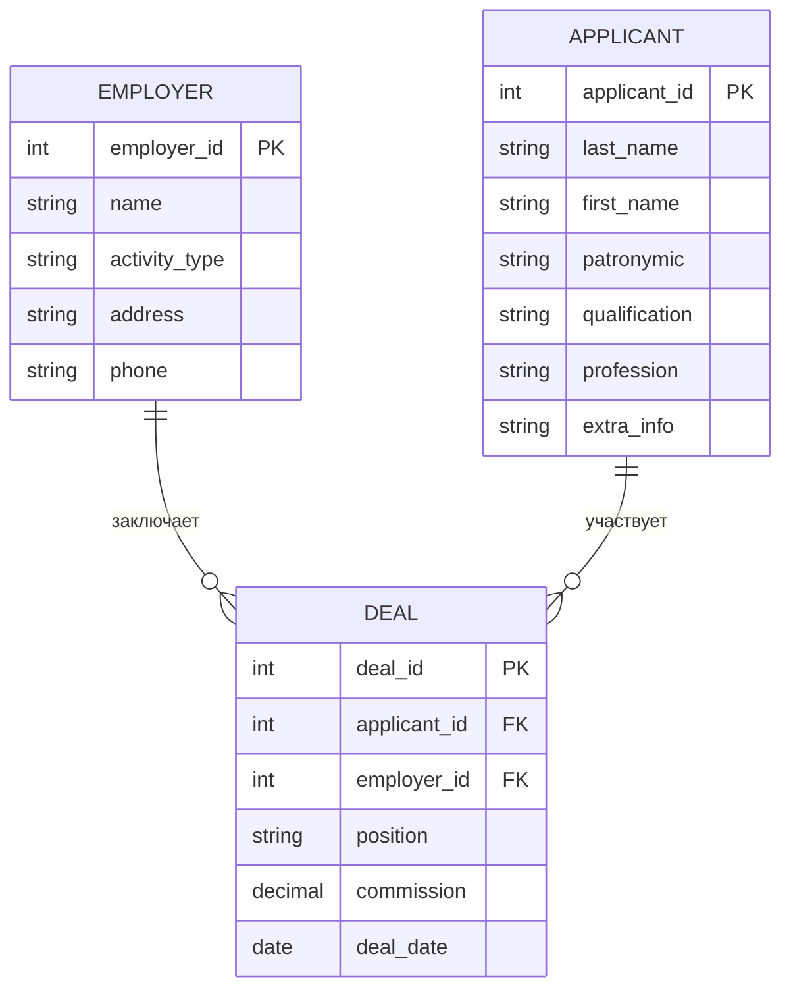

# Пункт 1. ER-модель предметной области

Предметная область: **Бюро по трудоустройству**

## Схема связей

## Таблицы

### Employer (Работодатель)
| Поле | Тип | Ключ |
|---|---|---|
| employer_id | INT | PK |
| name | VARCHAR | |
| activity_type | VARCHAR | |
| address | VARCHAR | |
| phone | VARCHAR | |

### Applicant (Соискатель)
| Поле | Тип | Ключ |
|---|---|---|
| applicant_id | INT | PK |
| last_name | VARCHAR | |
| first_name | VARCHAR | |
| patronymic | VARCHAR | |
| qualification | VARCHAR | |
| profession | VARCHAR | |
| extra_info | TEXT | |

### Deal (Сделка / Документ трудоустройства)
| Поле | Тип | Ключ |
|---|---|---|
| deal_id | INT | PK |
| applicant_id | INT | FK → Applicant |
| employer_id | INT | FK → Employer |
| position | VARCHAR | |
| commission | DECIMAL | |
| deal_date | DATE | |

Все таблицы находятся в 3НФ: неключевые атрибуты полностью и нетранзитивно зависят от первичного ключа, составных ключей с частичными зависимостями нет.

---

# Пункт 2. Выбор независимой сущности с наибольшим числом полей

| Сущность | Кол-во содержательных полей | Независимая? |
|---|---|---|
| Employer | 4 | Да |
| **Applicant** | **6** | **Да** |
| Deal | 5 | Нет (зависит от Employer и Applicant) |

**Вывод:** выбрана сущность **Applicant (Соискатель)** — она независима и имеет наибольшее число полей (6) среди независимых сущностей.

Начиная с этого пункта и до конца ЛР4 работа ведётся только с сущностью **Applicant**.
